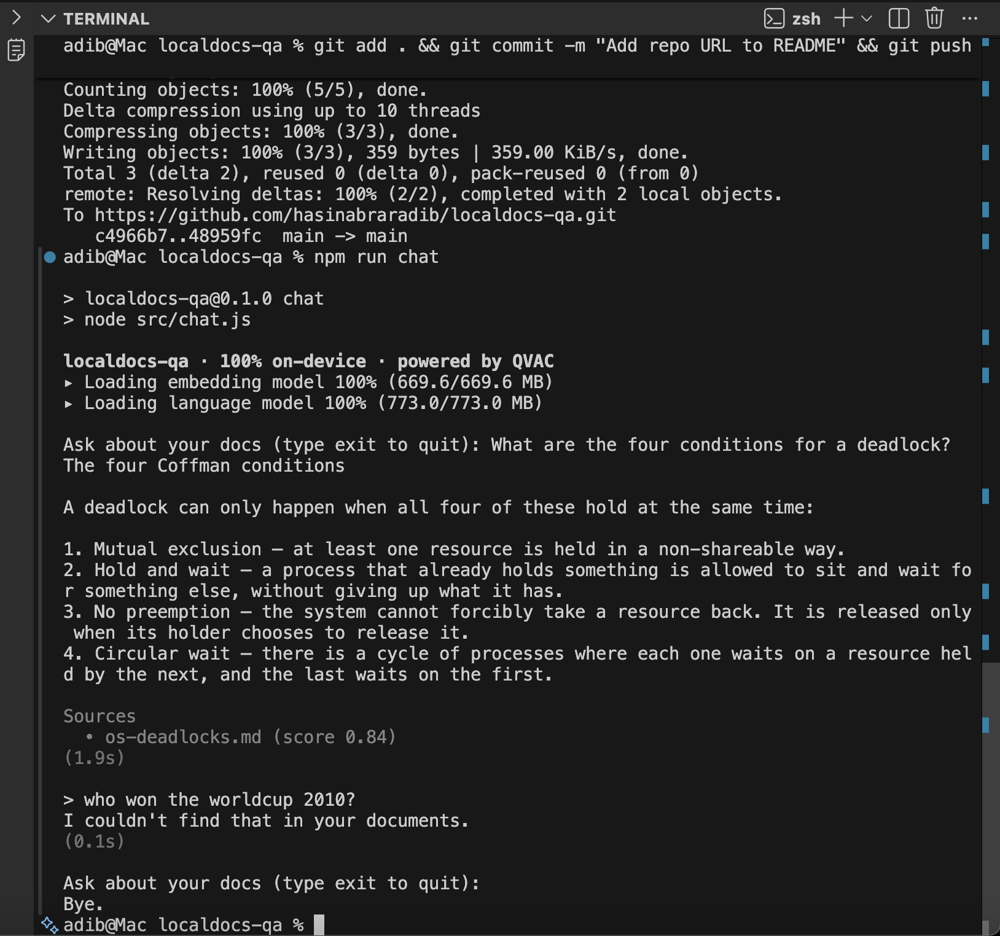

# localdocs-qa

Ask questions about your own notes — 100% offline, powered by Tether's QVAC SDK.



## Why

- **Private.** Your documents never leave your machine. Embedding, vector search and text generation all run locally.
- **No API key.** Nothing to sign up for.
- **No usage bill.** The only cost is disk space and your own CPU/GPU.
- **Works without internet.** The models are downloaded once and cached; after that the app runs with the network off.

## Features

- Ingest a folder of `.md` / `.txt` notes, searched recursively.
- One-shot questions from the shell: `npm run ask "..."`.
- An interactive chat session that loads the models once and reuses them.
- Source citations: every answer lists the files it came from, with their retrieval scores.
- A relevance threshold that refuses off-topic questions **without calling the LLM at all**.

## Requirements

- **Node.js** >= 22.17
- **npm** >= 10.9
- **A platform supported by QVAC.** macOS 14+ on Apple Silicon is recommended; this project was built and tested on Apple Silicon macOS 15. For Linux and Windows, check the [QVAC system requirements](https://docs.qvac.tether.io/system-requirements/).
- **Free disk space — roughly 6 GB.** Two separate costs: `npm install` writes about 4 GB into `node_modules`, because the SDK ships native inference engines for every modality, and the model weights add about 1.4 GB of downloads (the `~/.qvac` cache measured ~1.9 GB after both models, since it also holds registry data).

## Install

```bash
git clone https://github.com/hasinabraradib/localdocs-qa.git
cd localdocs-qa
npm install
```

## Run

1. **Add your notes.** Put `.md` or `.txt` files in `docs/`. Three sample notes are included, so you can skip this the first time.

2. **Check your setup (optional).** Loads the language model and streams one sentence, to confirm local inference works:
   ```bash
   npm run check
   ```

3. **Build the index.** Chunks every document, embeds it, and stores the vectors on disk:
   ```bash
   npm run ingest
   ```
   Re-run this whenever your documents change — each run rebuilds the index from scratch. To index a different folder: `npm run ingest -- ./path/to/notes`

4. **Ask one question:**
   ```bash
   npm run ask "What are the four conditions for a deadlock?"
   ```

5. **Or start a chat session:**
   ```bash
   npm run chat
   ```
   Type `exit` or `quit` (or press Ctrl+C) to leave.

**First run downloads the models** — about 1.4 GB in total, cached under `~/.qvac`. That download happens once. Every run after it works offline.

## QVAC SDK version

This project uses **`@qvac/sdk` 0.19.1**, declared as a regular dependency:

```json
"dependencies": {
  "@qvac/sdk": "^0.19.1"
}
```

Confirmed against the installed package:

```bash
$ node -p "require('./node_modules/@qvac/sdk/package.json').version"
0.19.1
```

## QVAC functions used

| Function | Used in | What it does here |
|---|---|---|
| `loadModel` | `src/models.js` | Loads the embedding and language models, reporting download progress. |
| `ragIngest` | `src/ingest.js` | Embeds document chunks and writes them to the local vector store. |
| `ragSearch` | `src/rag.js` | Finds the passages closest to a question. |
| `completion` | `src/rag.js`, `src/check.js` | Streams the answer from the local language model. |
| `unloadModel` | `src/ask.js`, `src/chat.js`, `src/ingest.js`, `src/check.js` | Frees a model's memory when the command finishes. |
| `ragListWorkspaces` | `src/rag.js`, `src/ingest.js` | Checks whether the index exists, and whether it is currently open. |
| `ragCloseWorkspace` | `src/ingest.js`, `src/ask.js`, `src/chat.js` | Releases the workspace while leaving its data on disk. |
| `ragDeleteWorkspace` | `src/ingest.js` | Deletes the old index so each ingest starts clean. |
| `close` | `src/ask.js`, `src/chat.js` | Shuts down the SDK's background worker so the process can exit. |

## Models

Both are QVAC model constants, and both run on-device:

| Model | Constant | Role |
|---|---|---|
| GTE-large (FP16) | `GTE_LARGE_FP16` | Turns chunks and questions into vectors for retrieval. |
| Llama 3.2 1B Instruct (Q4_0) | `LLAMA_3_2_1B_INST_Q4_0` | Writes the answer from the retrieved passages. |

## How it works

1. **Chunk.** Each document is split into ~800-character chunks with ~150 characters of overlap, preferring paragraph boundaries, and every chunk is tagged with the file it came from.
2. **Embed and store.** `ragIngest` embeds the chunks and saves the vectors to a local workspace called `localdocs`.
3. **Search.** A question is embedded with the same model, and `ragSearch` returns the four closest chunks.
4. **Answer.** Those chunks become the context for `completion`, which is instructed to answer from that text alone — then the source files are printed with their scores.

## Design notes

**Two layers of refusal.** A small model asked about something its documents don't cover will happily invent an answer, so the app guards that twice:

1. **A retrieval threshold** (`MIN_SCORE = 0.6` in `src/rag.js`). If the best matching chunk scores below it, the app prints `I couldn't find that in your documents.` and never calls the LLM. This is both faster and impossible to talk around.
2. **A strict system prompt.** Questions that clear the threshold but still aren't covered are refused by the model itself.

The threshold value was measured against the sample notes, not guessed: in-scope questions scored 0.644–0.842 and unrelated ones 0.507–0.668. Those ranges **overlap**, so no single threshold can separate them — which is exactly why the second layer exists. 0.6 is the highest cut that still clears every in-scope question tested.

**`temp: 0`.** The language model is loaded with greedy decoding. At the engine's default temperature the same question would swing between a good answer and a refusal across runs, which makes grounding rules impossible to test. With `temp: 0`, repeated runs give identical output.

## Project structure

```
localdocs-qa/
├── src/
│   ├── models.js    Model constants and a loader with a progress line
│   ├── chunker.js   Splits documents into overlapping chunks
│   ├── ingest.js    Builds the local index (npm run ingest)
│   ├── rag.js       Shared retrieval + answering logic
│   ├── ask.js       One-shot question (npm run ask)
│   ├── chat.js      Interactive session (npm run chat)
│   └── check.js     Setup smoke test (npm run check)
├── docs/            Your notes; three samples included
│   ├── os-deadlocks.md
│   ├── tcp-vs-udp.md
│   └── database-normalization.md
├── qvac.config.json SDK logging configuration
└── package.json
```

## License

[MIT](LICENSE)
